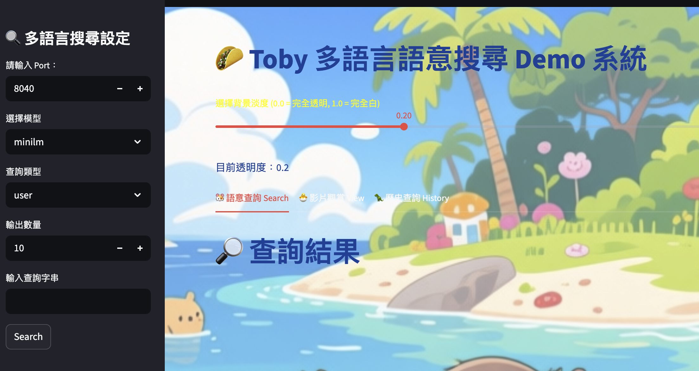
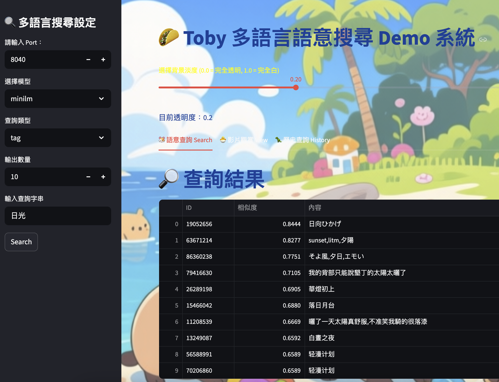
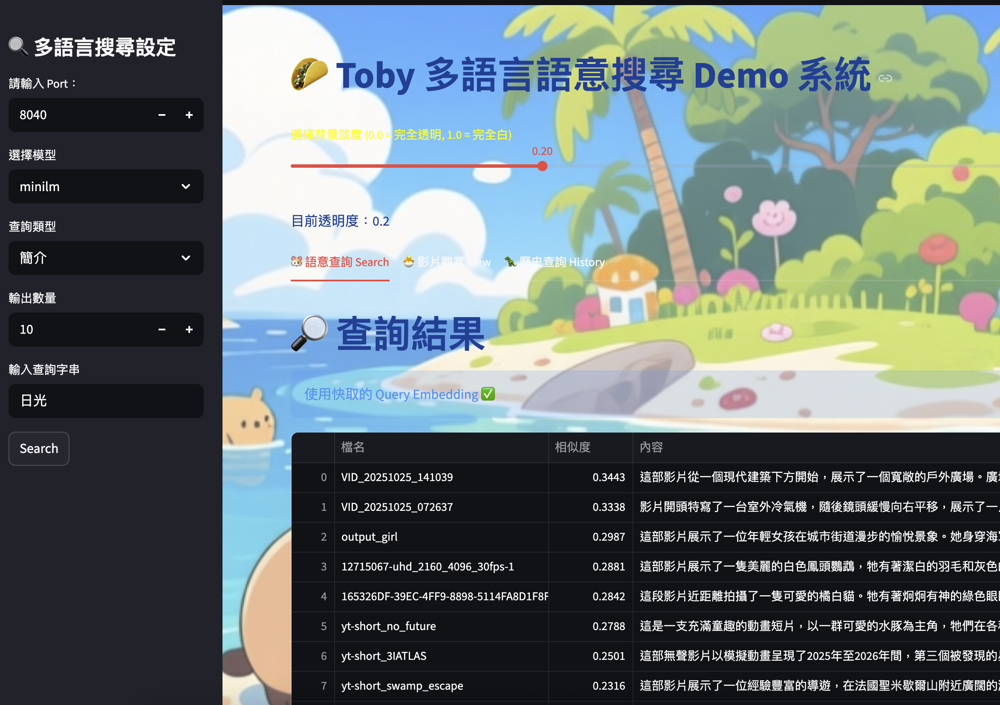
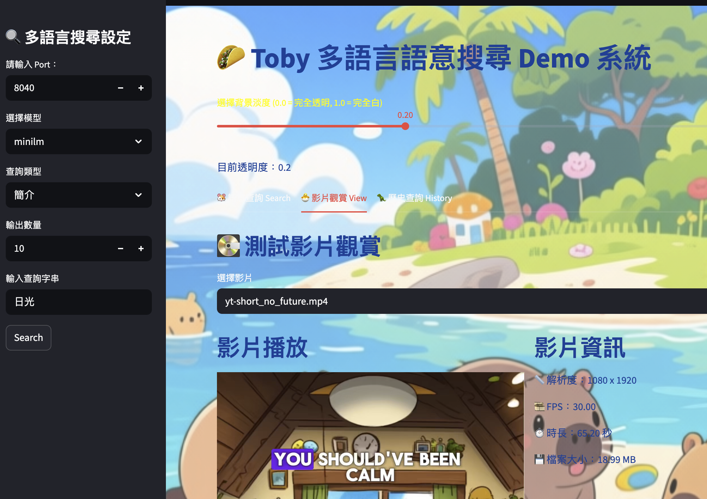
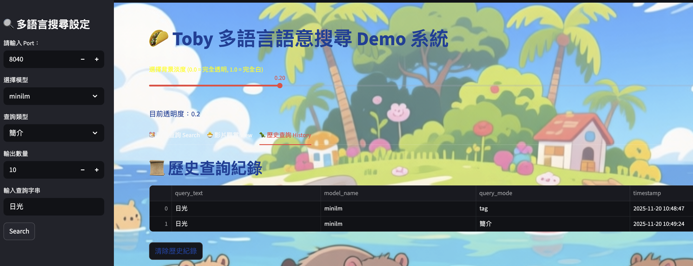

# semantic-search-demo
The demo for semantic search.

# 啟動
1. 準備 env，填入正確的值
2. 安裝 python 環境 `pip install -r requirements.txt`
3. 安裝 pytorch 環境 `pip install torch --index-url https://download.pytorch.org/whl/cpu`
4. `python main.py`
5. 如果要 video 服務到 vds/videos，跑 `python -m http.server 8040`

# 影片內容簡介

[Link Video Introduce](https://ai.studio/apps/drive/1NjSnIJGN1p5lwTVdgqCKVxXkHFUn5pPF)

效果圖預覽

